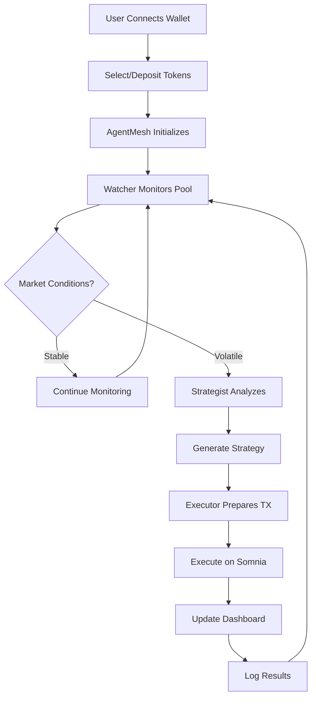
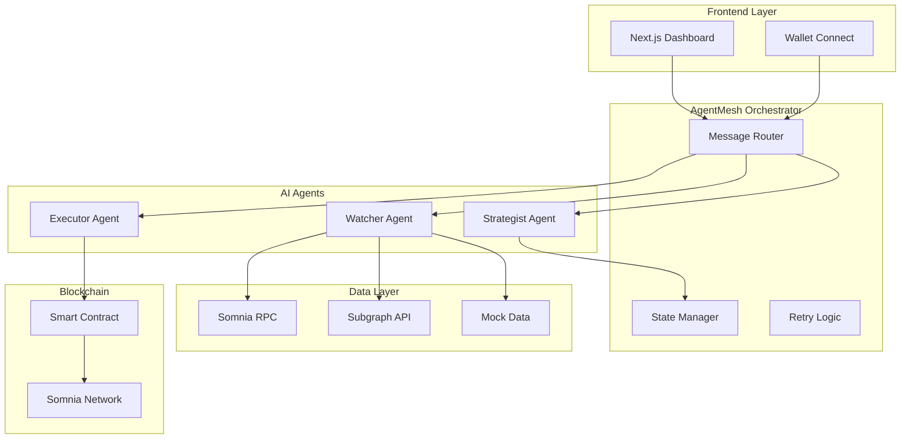
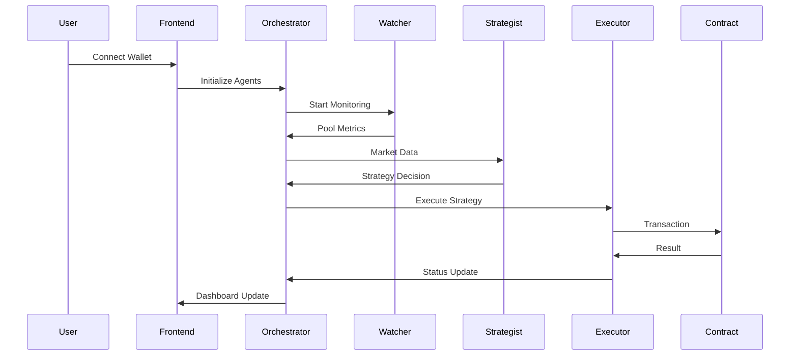

# 🧩 LiquidMesh — Coordinated Liquidity Manager (CLM)

**The AI orchestration layer for concentrated liquidity on Somnia.**

[]()

[Pitch Deck]()

LiquidMesh is a **multi-agent framework** designed to automate and optimize concentrated liquidity positions in Somnia’s DeFi ecosystem.
It coordinates specialized AI agents — the **Watcher**, **Strategist**, and **Executor** — to continuously monitor pool metrics, reason about market changes, and autonomously execute liquidity strategies.

### 🌊 Core Idea

> Turn DeFi liquidity management from manual labor into coordinated AI reasoning.

## 🚀 Key Features

-   **Autonomous liquidity management** - Fully autonomous liquidity optimization ensuring maximum capital efficiency and superior risk-adjusted yield.

-   **Multi-agent orchestration framework** - Modular agent orchestration framework using specialized AI agents Watcher, Strategist, Executor, for easy integration of new agents (e.g., risk, arbitrage).

-   **Superior Yield** - Maximizes capital efficiency and delivers superior risk-adjusted yield by constantly optimizing range positions.

-   **Self-Custodial** - Fully on-chain and self-custodial.

-   **DeFi UX Abstraction** - Simplifies the complex DeFi UX.

-   **AI Native DeFi to Somnia** - Optimized for low-latency execution and high TVL contribution to the Somnia ecosystem.

## 🔄 How It Works — Workflow

### Agent Roles and Functions:

-   **Watcher Agent** — Fetches and tracks pool metrics (price, volume, volatility, range status). Sends structured data to Strategist.
-   **Strategist Agent** — Decides optimal liquidity range and rebalance strategy; explains reasoning. Sends strategy intent to Executor.
-   **Executor Agent** — Prepares and/or signs transaction payload for optimal strategy execution. Returns result/status.
-   **AgentMesh Orchestrator** — Routes messages, manages state, and handles execution logic/retries. Logs decisions and outcomes.

### Agent Workflow



### Full User Flow:

1. **User connects wallet** (Somnia testnet or mock)
2. **User selects or deposits tokens** for liquidity
3. **AgentMesh initializes and activates agents**
4. **Watcher starts tracking pool data** (live or mock)
5. **Strategist proposes new LP range and rationale** (e.g., "volatility rising — narrow range for higher fee capture")
6. **Executor simulates or produces a signed transaction payload**
7. **Dashboard visualizes agent reasoning & rationale**, before/after metrics, and strategy performance projections
8. **Loop repeats periodically** (e.g., hourly) or upon real-time market event triggers

## 🏗️ Technical Architecture

### System Overview



### Architecture Flow



### ⚙️ Tech Stack

| Layer          | Technology                                     | Purpose                      |
| -------------- | ---------------------------------------------- | ---------------------------- |
| **Frontend**   | [Next.js 15](https://nextjs.org)               | React framework with SSR/SSG |
|                | [Tailwind CSS](https://tailwindcss.com)        | Utility-first CSS framework  |
|                | [Shadcn UI](https://ui.shadcn.com/)            | Component library            |
|                | [Wagmi](https://wagmi.sh)                      | React hooks for Ethereum     |
|                | [Viem](https://viem.sh)                        | TypeScript Ethereum library  |
| **Backend**    | [Node.js](https://nodejs.org/)                 | Runtime environment          |
|                | [Bun](https://bun.sh/)                         | Fast JavaScript runtime      |
|                | [Hono](https://hono.dev/)                      | Lightweight web framework    |
|                | [Supabase](https://supabase.com/)              | Backend-as-a-Service         |
| **AI/Agents**  | [Vercel AI SDK](https://www.vercel.com/ai-sdk) | AI integration framework     |
|                | [OpenAI](https://openai.com/)                  | Large Language Model         |
| **Blockchain** | [Somnia Testnet](https://docs.somnia.network/) | Target blockchain            |
|                | [Solidity](https://docs.soliditylang.org/)     | Smart contract language      |
|                | [Hardhat](https://hardhat.org/)                | Development framework        |
| **Wallet**     | [Privy](https://docs.privy.io/)                | Wallet connection service    |

## 🚀 Getting Started

### Prerequisites

-   [Bun](https://bun.sh/) installed
-   [Node.js](https://nodejs.org/) 18+
-   [Git](https://git-scm.com/) for version control

### Installation

1. **Clone the repository**

    ```bash
    git clone https://github.com/samueldanso/liquidmesh-somnia-ai
    cd liquidmesh-somnia-ai
    ```

2. **Install dependencies**

    ```bash
    bun install
    ```

3. **Environment setup**

    ```bash
    cp .env.example .env
    # Edit .env with your configuration
    ```

4. **Start development server**
    ```bash
    bun dev
    ```

### Development Commands

```bash
# Start development server
bun dev

# Build for production
bun run build

# Run tests
bun test

# Lint code
bun run lint

# Format code
bun run format
```

## 🚀 Deploy

Follow the deployment guides for [Vercel](https://nextjs.org/learn-pages-router/basics/deploying-nextjs-app/deploy).

## 📋 Roadmap

1. Build minimal AgentMesh core
2. Implement Watcher, Strategist, and Executor
3. Integrate Somnia pool data and simulation engine
4. Deliver demo dashboard + orchestrated CLM pipeline
5. Submit for Somnia AI Hackathon

## 🏆 Built at Somnia AI Hackathon 2025

**Team**

-   **Samuel Danso - Full Stack Product & Engineering** – `me.samueldanso@gmail.com`

## 🔗 Links

-   **Live Demo**: [LiquidMesh](https://liquidmesh-somnia-ai.vercel.app)
