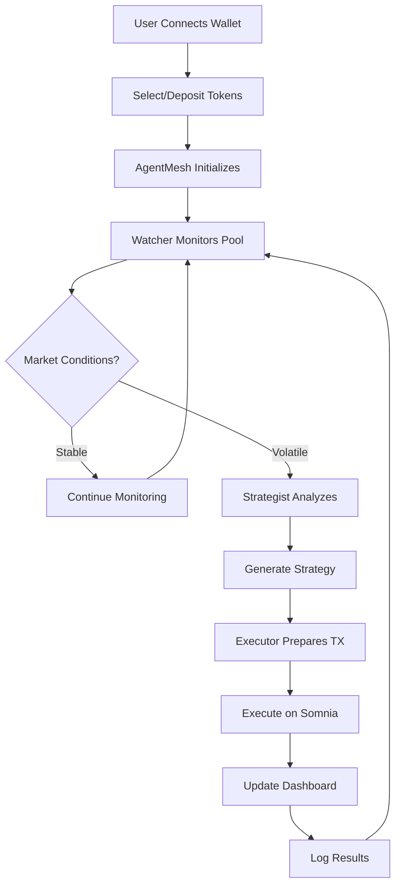
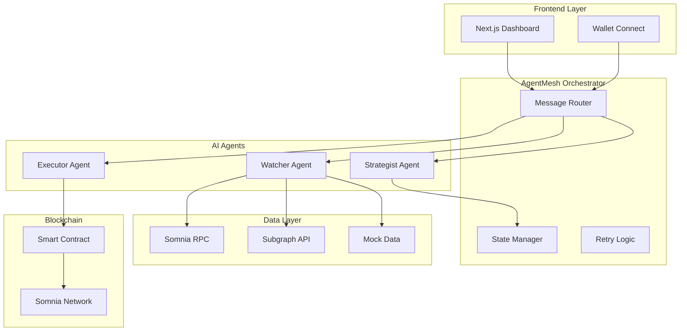
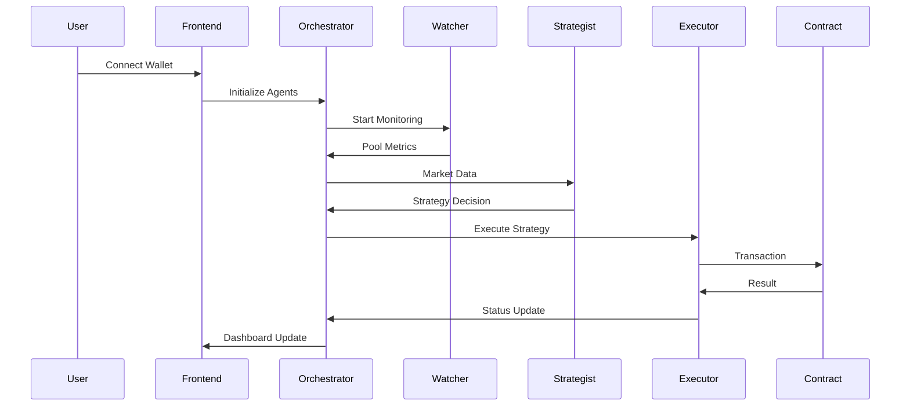

# 🧩 LiquidMesh Finance— Coordinated Liquidity Manager (CLM)

**The AI orchestration layer for concentrated liquidity on Somnia.**

-   **Video Demo**: [Watch Demo]()
-   **Pitch Deck**: [View Presentation]()

LiquidMesh is a **decentralized, non-custodial autonomous liquidity orchestration protocol** built on Somnia powered by a multi-agent orchestration framework. It enables liquidity providers (LPs) to achieve maximum capital efficiency and superior risk-adjusted yield by autonomously reasoning, executing, and managing liquidity positions across Somnia DEXes and beyond.

It coordinates specialized AI agents — the **Watcher**, **Strategist**, and **Executor** — to continuously monitor pool metrics, reason about market changes, and autonomously execute liquidity strategies.

### 🌊 Core Idea

> Turn DeFi liquidity management from manual labor into coordinated AI reasoning.

## 🚀 Key Features

-   **Autonomous Management** - Fully automated liquidity optimization for maximum capital efficiency
-   **Multi-Agent Orchestration** - Specialized AI agent (Watcher, Strategist, Executor) coordinate autonomously using a modular, extensible architecture pattern
-   **Superior Yield** - Constantly optimizes range positions for better returns
-   **Self-Custodial** - Fully on-chain and non-custodial
-   **Simplified UX** - Abstracts complex DeFi interactions
-   **Somnia Native** - Optimized for low-latency execution on Somnia ecosystem

## 🔄 How It Works — Workflow

### Agent Roles and Functions:

-   **Watcher Agent** — Fetches and tracks pool metrics (price, volume, volatility, range status). Sends structured data to Strategist.
-   **Strategist Agent** — Decides optimal liquidity range and rebalance strategy; explains reasoning. Sends strategy intent to Executor.
-   **Executor Agent** — Prepares and/or signs transaction payload for optimal strategy execution. Returns result/status.
-   **AgentMesh Orchestrator** — Routes messages, manages state, and handles execution logic/retries. Logs decisions and outcomes.

### Agent Workflow



### User Flow:

1. **Connect wallet** and deposit tokens
2. **Agents initialize** and start monitoring
3. **Strategist analyzes** market conditions and proposes optimal ranges
4. **Executor executes** transactions automatically
5. **Dashboard shows** real-time performance and agent reasoning
6. **Continuous optimization** based on market changes

## 🏗️ Multi-Agent Orchestration Architecture

LiquidMesh is built on a **modular multi-agent orchestration pattern** designed for coordinated AI reasoning in DeFi.

### Architecture Principles

**Separation of Concerns**

-   Each agent has a single, well-defined responsibility
-   Watcher = Data collection | Strategist = Decision-making | Executor = Transaction handling

**Agent Coordination**

-   AgentMesh Orchestrator routes messages between agents
-   Shared state management across agent lifecycle
-   Built-in retry logic and error handling

**Modularity & Extensibility**

-   Agents can be upgraded or replaced independently
-   Clear interfaces enable custom agent development
-   Pattern applicable to risk management, arbitrage, governance automation

**Technical Implementation**

-   Message routing via EventEmitter/lightweight message bus
-   Real-time coordination and decision logging
-   Fault-tolerant design prevents single points of failure

This architecture demonstrates a reusable pattern for building AI-native DeFi applications on Somnia.

## 🏗️ Technical Architecture & Agent Orchestration

### System Overview



### Architecture Flow



### ⚙️ Tech Stack

-   **Frontend:** [Next.js 15](https://nextjs.org), [Tailwind CSS](https://tailwindcss.com), [Shadcn UI](https://ui.shadcn.com/),
-   **Backend:** [Node.js](https://nodejs.org/) with [Bun](https://bun.sh/), [Hono](https://hono.dev/), [Supabase](https://supabase.com/)
-   **AI/Agent:** [Vercel AI SDK](https://www.vercel.com/ai-sdk)
-   **LLM:** [OpenAI](https://openai.com/)
-   **Smart Contracts:** [Solidity](https://docs.soliditylang.org/) & [Hardhat](https://hardhat.org/docs/getting-started)
-   **Blockchain:** [Somnia Testnet](https://docs.somnia.network/)
-   **Web3 Integration:** [wagmi](https://wagmi.sh) & [viem](https://viem.sh)
-   **Connect Wallet:** [Privy](https://docs.privy.io/)

## 🚀 Getting Started

1. Clone the repository

    ```bash
    git clone https://github.com/samueldanso/liquidmesh-somnia-ai
    cd liquidmesh-somnia-ai
    ```

2. Install dependencies

    ```bash
    bun install
    ```

3. Copy the `.env.example` to `.env` and update the variables.

    ```bash
    cp .env.example .env
    ```

4. Start the development server

    ```bash
    bun dev
    ```

## 🚀 Deploy

Follow the deployment guides for [Vercel](https://nextjs.org/learn-pages-router/basics/deploying-nextjs-app/deploy).

## 📋 Roadmap

**Phase 1: Core System (Hackathon)**

1. Build AgentMesh orchestration core
2. Implement specialized agents (Watcher, Strategist, Executor)
3. Integrate Somnia pool data and simulation engine
4. Deliver demo dashboard + orchestrated CLM pipeline

**Phase 2: Framework Evolution (Post-Hackathon)** 5. Abstract AgentMesh for general DeFi use cases 6. Developer documentation for custom agents 7. Additional agent examples (risk management, arbitrage) 8. Community SDK and tooling

## 🏆 Built at Somnia AI Hackathon 2025

## 🎯 Hackathon Tracks

**Primary: DeFi Agents** - Autonomous CLM protocol solving real LP pain points on Somnia

**Secondary: Infra Agents** - Multi-agent orchestration architecture demonstrating coordinated AI reasoning patterns for DeFi

**Team**

-   **Samuel Danso - Full Stack Product & Engineering** – `me.samueldanso@gmail.com`

## 🔗 Links

-   **Live Demo**: [LiquidMesh](https://www.liquidmeshfi.xyz/)
