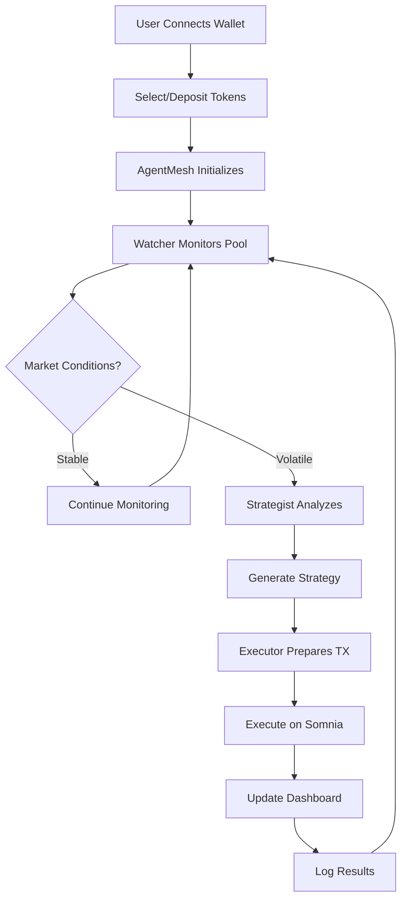
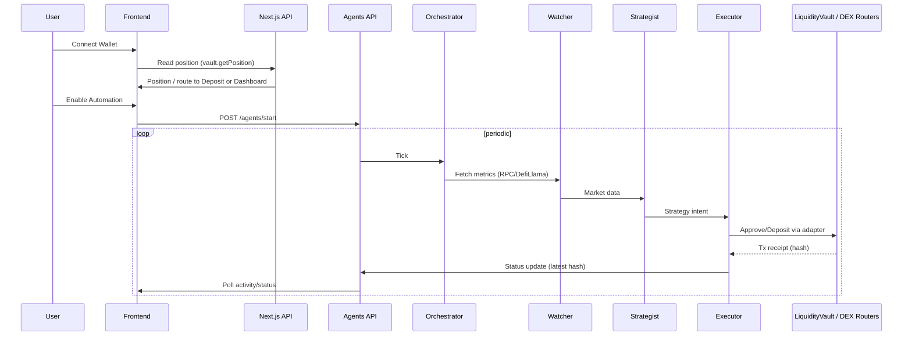

# 💧 LiquidMesh Finance— Coordinated Liquidity Manager (CLM)

**The AI orchestration layer for concentrated liquidity on Somnia.**

-   **Video Demo**: [Watch Demo](https://youtu.be/P9GxJHiaDZ8)
-   **Pitch Deck**: [View Presentation](https://docs.google.com/presentation/d/1CEXuzhR3oKazKGyRiHKeAKz3YBoGgwpa/edit?usp=sharing&ouid=106871444288832035093&rtpof=true&sd=true)

LiquidMesh is a **decentralized, non-custodial autonomous liquidity orchestration protocol** built on Somnia powered by a multi-agent orchestration framework. It enables liquidity providers (LPs) to achieve maximum capital efficiency and superior risk-adjusted yield by autonomously reasoning, executing, and managing liquidity positions across Somnia DEXes and beyond.

It coordinates specialized AI agents — the **Watcher**, **Strategist**, and **Executor** — to continuously monitor pool metrics, reason about market changes, and autonomously execute liquidity strategies.

## ⚠️ Problem

Liquidity provision on Somnia DEXes is still manual, fragmented, and inefficient.

LPs must constantly monitor pools and rebalance positions, yet most liquidity remains idle or misplaced during market changes.

This leads to poor capital utilization, lower yields, and high barriers for everyday participants.

## 💡 Solution

LiquidMesh introduces a multi-agent orchestration framework that autonomously manages concentrated liquidity.

Three specialized AI agents — Watcher, Strategist, and Executor — continuously monitor pools, reason about market changes, and execute optimized strategies on behalf of LPs — all managed by our AgentMesh Orchestrator.

### 🌊 Core Idea

> Turn DeFi liquidity management from manual labor into coordinated AI reasoning.

## 🚀 Key Features

-   **Autonomous Management** - Fully automated liquidity optimization for maximum capital efficiency
-   **Multi-Agent Orchestration** - Specialized AI agent (Watcher, Strategist, Executor) coordinate autonomously using a modular, extensible architecture pattern
-   **Superior Yield** - Constantly optimizes range positions for better returns
-   **Self-Custodial** - Fully on-chain and non-custodial
-   **Simplified UX** - Abstracts complex DeFi interactions
-   **Somnia Native** - Optimized for low-latency execution on Somnia ecosystem

## 🔄 How It Works — Workflow

### Agent Roles and Functions:

-   **Watcher Agent** — Fetches and tracks pool metrics (price, volume, volatility, range status). Sends structured data to Strategist.
-   **Strategist Agent** — Decides optimal liquidity range and rebalance strategy; explains reasoning. Sends strategy intent to Executor.
-   **Executor Agent** — Prepares and/or signs transaction payload for optimal strategy execution. Returns result/status.
-   **AgentMesh Orchestrator** — Routes messages, manages state, and handles execution logic/retries. Logs decisions and outcomes.

### Agent Workflow



### User Flow (Current App):

1. Connect wallet on the app domain.
2. Smart entry/guard: if you have an active vault position → go to Dashboard; otherwise → Deposit flow.
3. Deposit flow (stepper):
    - Faucet: wrap STT → wSTT and mint USDC (test assets).
    - Deposit: approve tokens and deposit pair into `LiquidityVault`.
    - Activate: enable automation (interval/cooldown), which starts the agent loop.
4. Dashboard: monitor Agent Status, Positions, Pool metrics, and Activity (with explorer links).
5. Automation runs periodically; you can stop/start agents anytime from the dashboard.

## 🏗️ Multi-Agent Orchestration Architecture

LiquidMesh is built on a **modular multi-agent orchestration pattern** designed for coordinated AI reasoning in DeFi.

### Architecture Principles

**Separation of Concerns**

-   Each agent has a single, well-defined responsibility
-   Watcher = Data collection | Strategist = Decision-making | Executor = Transaction handling

**Agent Coordination**

-   AgentMesh Orchestrator routes messages between agents
-   Shared state management across agent lifecycle
-   Built-in retry logic and error handling

**Modularity & Extensibility**

-   Agents can be upgraded or replaced independently
-   Clear interfaces enable custom agent development
-   Pattern applicable to risk management, arbitrage, governance automation

**Technical Implementation**

-   Message routing via EventEmitter/lightweight message bus
-   Real-time coordination and decision logging
-   Fault-tolerant design prevents single points of failure

This architecture demonstrates a reusable pattern for building AI-native DeFi applications on Somnia.

## 🏗️ Technical Architecture & Agent Orchestration

### System Overview

```mermaid
graph TB
    subgraph "Frontend Layer"
        UI[Next.js Dashboard]
        Wallet[Wallet Connect]
    end

    subgraph "AgentMesh Orchestrator"
        Router[Message Router]
        State[State Manager]
        Retry[Retry Logic]
    end

    subgraph "AI Agents"
        Watcher[Watcher Agent]
        Strategist[Strategist Agent]
        Executor[Executor Agent]
    end

    subgraph "Data Layer"
        RPC[Somnia RPC]
        DefiLlama[DefiLlama]
    end

    subgraph "Blockchain"
        Vault[LiquidityVault]
        DEXRouters[DEX Routers (SomniaEx V2 / V3 venues)]
        Somnia[Somnia Network]
    end

    UI --> Router
    Wallet --> Router
    Router --> Watcher
    Router --> Strategist
    Router --> Executor
    Watcher --> RPC
    Watcher --> DefiLlama
    Strategist --> State
    Executor --> Vault
    Executor --> DEXRouters
    Vault --> Somnia
    DEXRouters --> Somnia
```

### Architecture Flow (Sequence)



### ⚙️ Tech Stack

-   **Frontend:** [Next.js 15](https://nextjs.org), [Tailwind CSS](https://tailwindcss.com), [shadcn/ui](https://ui.shadcn.com), [TanStack Query](https://tanstack.com/query)
-   **Backend (Agents):** [Bun](https://bun.sh/) + [Hono](https://hono.dev/) API, [Supabase](https://supabase.com) persistence
-   **AI/Agents:** [Vercel AI SDK](https://www.vercel.com/ai-sdk), [OpenAI](https://openai.com/)
-   **Smart Contracts:** [Solidity](https://docs.soliditylang.org/) + [Hardhat](https://hardhat.org/docs/getting-started)
-   **Blockchain:** [Somnia Testnet](https://docs.somnia.network/), [Somnia Testnet Explorer](https://shannon-explorer.somnia.network)
-   **Web3 Integration:** [wagmi](https://wagmi.sh), [viem](https://viem.sh)
-   **Wallet:** [Privy](https://docs.privy.io/)
-   **DEX Adapters:** Somnia Exchange V2 implemented; Somnex/QuickSwap V3 prepared

## DEX Integrations on Somnia

-   **Somnia Exchange V2** (Integrated)
    -   Adapter: `agents/src/adapters/somnia-exchangev2.ts`
    -   Pattern: Uniswap V2-style router (add/remove liquidity)
    -   Pairs: wSTT / USDC
-   **Somnex V3** (Planned — adapter stubbed)
    -   Adapter: `agents/src/adapters/somnex-v3.ts`
    -   Pattern: Concentrated liquidity (position manager)
    -   Status: Awaiting factory/position manager addresses on Somnia Testnet
-   **QuickSwap V3** (Planned — adapter stubbed)
    -   Adapter: `agents/src/adapters/quickswap-v3.ts`
    -   Pattern: Uniswap V3-compatible position manager
    -   Status: To be wired when deployment endpoints are available

## Frontend ↔ Agents Integration (Overview)

-   Env: `NEXT_PUBLIC_AGENTS_API_URL` used by the frontend to call the agents backend via Next.js API routes.
-   Next.js API proxy routes:
    -   `GET /api/thoughts` → agents `/thoughts`
    -   `GET /api/thoughts/[agent]` → agents `/thoughts/:agent`
    -   `GET /api/positions` → agents `/positions`
    -   `GET /api/positions/pools` → agents `/positions/pools`
-   Client hooks (TanStack Query):
    -   `useAgentThoughts(agent?)`, `useLiquidityPositions()`, `usePoolMetrics()`, `useDashboardStats()`
-   Benefits: hides backend URL, server-side error handling, no CORS, production-ready.

## Vercel Deployment (Frontend)

Environment variables (Vercel → Settings → Environment Variables):

```bash
NEXT_PUBLIC_APP_URL=https://your-app.vercel.app
NEXT_PUBLIC_PRIVY_APP_ID=your_privy_app_id
NEXT_PUBLIC_CHAIN_ID=50312
NEXT_PUBLIC_AGENTS_API_URL=https://your-agents-api.example.com
```

Post-deploy checks:

-   `GET /api/agents/status`
-   `POST /api/agents/start` / `POST /api/agents/stop`
-   `GET /api/positions`, `GET /api/thoughts`

## Somnia Exchange (Testnet) Contract Addresses

Official addresses (from Somnia Exchange docs):

-   wSTT (wrapped native): `0xF22eF0085fc511f70b01a68F360dCc56261F768a`
-   Factory (V2): `0x31015A978c58515EdE29D0F969a17e116BC1866B1`
-   Router (V2): `0xb98c15a0dC1e271132e341250703c7e94c059e8D`

## Verified Contract Addresses (Somnia Testnet Explorer)

| Contract       | Address                                      | Explorer                                                                                        |
| -------------- | -------------------------------------------- | ----------------------------------------------------------------------------------------------- |
| WrappedSTT     | `0x9e1B4FbB45F30b0628e4C406A6F4Eec1fadb54E1` | https://shannon-explorer.somnia.network/address/0x9e1B4FbB45F30b0628e4C406A6F4Eec1fadb54E1#code |
| MockUSDC       | `0x758dA18F8424f637f788a0CD0DAF8407069D380b` | https://shannon-explorer.somnia.network/address/0x758dA18F8424f637f788a0CD0DAF8407069D380b#code |
| LiquidityVault | `0x28205BB97e1BEe146E0b095D3cf62433D9bAb47d` | https://shannon-explorer.somnia.network/address/0x28205BB97e1BEe146E0b095D3cf62433D9bAb47d#code |
| AgentExecutor  | `0x5e639e2F345577514aFA0159AEdDf0A832e4139f` | https://shannon-explorer.somnia.network/address/0x5e639e2F345577514aFA0159AEdDf0A832e4139f#code |

## Monorepo Structure

```
liquidmesh-somnia-ai/
├── agents/                 # Bun + Hono backend (multi-agent orchestration)
│   ├── src/
│   │   ├── adapters/       # DEX adapters (somnia-exchangev2, somnex-v3 stub, quickswap-v3 stub)
│   │   ├── agents/         # watcher/strategist/executor
│   │   ├── comms/          # event-bus
│   │   ├── memory/         # supabase persistence
│   │   └── routes/         # /agents/*, /thoughts, /positions APIs
│   └── README.md
├── frontend/               # Next.js 15 app (App Router)
│   ├── app/                # routes (/(app)/dashboard, /(app)/deposit, /api/* proxies)
│   ├── components/         # ui + layout + web
│   ├── hooks/              # use-agent-data.ts
│   └── README.md
├── contracts/              # Solidity contracts + notes
│   └── README.md
├── docs/                   # docs
├── TESTING-GUIDE.md
└── README.md
```

## Setup Guide

### Prerequisites

-   Bun (latest) and Node 18+
-   Somnia Testnet RPC (default provided)
-   Supabase project (for agents thoughts persistence)

### 1) Frontend

Create `frontend/.env.local` with the following:

```bash
# Frontend
NEXT_PUBLIC_APP_URL=http://localhost:3000
NEXT_PUBLIC_PRIVY_APP_ID=your_privy_app_id
NEXT_PUBLIC_CHAIN_ID=50312

# Agents backend (proxy target for Next.js API routes)
NEXT_PUBLIC_AGENTS_API_URL=http://localhost:8000
```

Install & run:

```bash
cd frontend
bun install
bun run dev # http://localhost:3000
```

### 2) Agents Backend

Create `agents/.env`:

```bash
# OpenAI
OPENAI_API_KEY=sk-...

# Supabase
SUPABASE_URL=https://your-project.supabase.co
SUPABASE_KEY=your-anon-key

# Wallets used by executor agent (testnet)
PRIVATE_KEY=0x...
# Optional dedicated signer for execution
AGENT_PRIVATE_KEY=0x...

# Optional overrides
PORT=8000
AUTO_START=false
CHECK_INTERVAL_HOURS=2
MODEL_NAME=gpt-4o

# Somnia RPC
SOMNIA_RPC_URL=https://dream-rpc.somnia.network
```

Install & run:

```bash
cd agents
bun install
bun run dev # http://localhost:8000
```

### 3) Contracts

See `contracts/README.md` for compile/deploy steps.

## API Documentation

### Frontend → Next.js API Routes

-   `GET /api/thoughts` → agents `/thoughts`
-   `GET /api/thoughts/[agent]` → agents `/thoughts/:agent`
-   `GET /api/positions` → agents `/positions`
-   `GET /api/positions/pools` → agents `/positions/pools`
-   `POST /api/agents/start` → agents `/agents/start`
-   `POST /api/agents/stop` → agents `/agents/stop`
-   `GET /api/agents/status` → agents `/agents/status`

### Agents Backend Endpoints

-   `GET /thoughts` – list recent thoughts from watcher/strategist/executor
-   `GET /thoughts/:agent` – filter by agent
-   `GET /positions` – positions data for dashboard
-   `GET /positions/pools` – pool metrics
-   `POST /agents/start` – start autonomous loop
-   `POST /agents/stop` – stop autonomous loop
-   `GET /agents/status` – current status (online/offline, wallet, next check)
-   `GET /agents/tx/latest` – latest adapter transaction hash for UI activity

## Notes on Demo Resilience

-   If OpenAI quota is exhausted or the backend is unreachable, the dashboard quietly falls back to static snapshots in `frontend/public/demo/` for thoughts, positions, and pools. This keeps the demo stable during judging while live mode remains supported.

## 📋 Roadmap

**Phase 1: Core System (Hackathon)**

1. ✅ Build AgentMesh orchestration core
2. ✅ Implement specialized agents (Watcher, Strategist, Executor)
3. ✅ Integrate Somnia pool data and simulation engine
4. ✅ Deliver demo dashboard + orchestrated CLM pipeline

**Phase 2: Framework Evolution (Post-Hackathon)**

5. Abstract AgentMesh for general DeFi use cases
6. Developer documentation for custom agents
7. Additional agent examples (risk management, arbitrage)
8. Community SDK and tooling

## 🏆 Built at Somnia AI Hackathon 2025

## 🎯 Hackathon Tracks

**Primary: DeFi Agents** - Autonomous CLM protocol solving real LP pain points on Somnia

**Secondary: Infra Agents** - Multi-agent orchestration architecture demonstrating coordinated AI reasoning patterns for DeFi

**Team**

-   **Samuel Danso - Full Stack Product & Engineering** – `me.samueldanso@gmail.com`

## 🔗 Links

-   **Live Demo**: [liquidmeshfi.xyz](https://liquidmeshfi.xyz)
-   **Documentation**: [docs.liquidmeshfi.xyz](https://docs.liquidmeshfi.xyz)
-   **Docs (Local)**: `cd docs && bun install && bun run dev`
