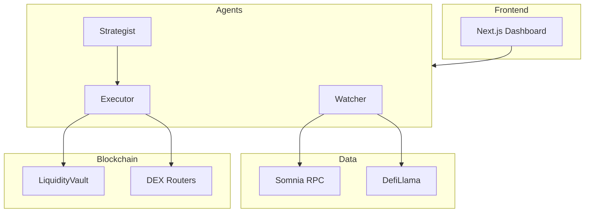
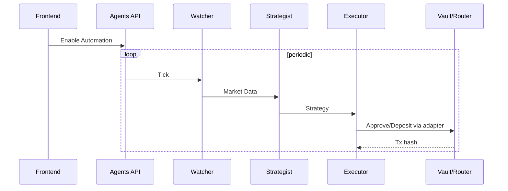

### System Overview

```mermaid
graph TB
  subgraph Frontend
    UI[Next.js Dashboard]
  end

  subgraph Agents
    W[Watcher]
    S[Strategist]
    E[Executor]
  end

  subgraph Data
    RPC[Somnia RPC]
    DL[DefiLlama]
  end

  subgraph Blockchain
    Vault[LiquidityVault]
    Routers[DEX Routers]
  end

  UI --> Agents
  W --> RPC
  W --> DL
  S --> E
  E --> Vault
  E --> Routers
```

### Sequence

```mermaid
sequenceDiagram
  participant UI as Frontend
  participant AG as Agents API
  participant W as Watcher
  participant S as Strategist
  participant E as Executor
  participant V as Vault/Router

  UI->>AG: Enable Automation
  loop periodic
    AG->>W: Tick
    W->>S: Market Data
    S->>E: Strategy
    E->>V: Approve/Deposit via adapter
    V-->>E: Tx hash
  end
```
